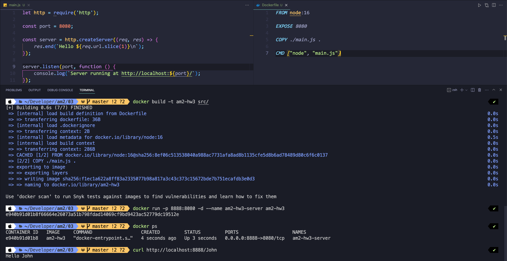

= 3. Node.js server in Docker 

== Tasks

* Implement a simple HTTP server in Node.js
** implement a "hello NAME" service endpoint
** request: "http://localhost:8080/John", response "Hello John"

* Define an image Dockerfile, with the following specifications:
** build on a chosen node.js image
** the container should listen on port 8888
** load the server implementation from a local directory
** run the server

* Create a docker image from the Dockerfile

* Create a container for the image
** tip: use the **-p** parameter to map public port to a private port inside the container (e.g. -p 8080:8888)

* Check if the container is running (docker container ls)

* Send several requests to the server running within the container 
** you can use ping, curl or telnet for testing

* Stop the container

== Solution

=== Docker

==== build container

```bash
$ docker build -t am2-hw3 src/
```

==== Run container

```bash
$ docker run -p 8888:8080 -d --name am2-hw3-server am2-hw3
```

==== Results

