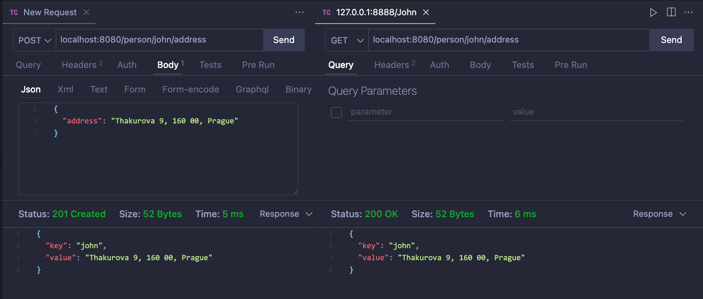

= 4. Docker advanced

First, lets pull redis image:

`$ docker pull redis`

== Using Redis in node.js

Redis - an in-memory data structure store which can be used as a database, a cache and a message broker.

Install Redis client in node.js

`npm install redis`

Using Redis in node.js

[source,javascript]
----
var redis = require('redis');
var client = redis.createClient(); // it will connect by default to a server at 127.0.0.1 and port 6379
----

To specify the IP and port

[source,javascript]
----
var client = redis.createClient(port, host);
----

Listen when connected

[source,javascript]
----
client.on('connect', function() {
    console.log('Redis client connected');
});
----

Listen on error

[source,javascript]
----
client.on('error', function (err) {
    console.log('Something went wrong ' + err);
});
----

To insert and get value from Redis

[source,javascript]
----
client.set('my test key', 'my test value', redis.print);
client.get('my test key', function (error, result) {
    if (error) {
        console.log(error);
        throw error;
    }
    console.log('GET result ->' + result);
});
----

== Linking Containers

* `docker run -d --name redis1 redis` -> will run a redis container, with name `redis1`
* `docker run -it --link redis1:redis --name redisclient1 busybox` -> will run busybox container, with name `redisclient1`
** we link the two containers by specifying the `--link` flag

Or run the following command to launch a container based on the redis image but this time we will launch the redis server.
This will take you into the shell where all redis client tools can be used.

`docker run -it --link redis1:redis --name client1 redis sh`

Launch the redis client (redis-cli) and connect to our redis server (running in another container and to which we have linked) as given below:

``# redis-cli -h redis
redis:6379>
``

Run some redis commands

``redis:6379> PING
PONG
redis:6379> set myvar DOCKER
OK
redis:6379> get myvar
"DOCKER"
redis:6379>
``

To run another redis client which will communicate with the redis server run:

`$ docker run -it --link redis1:redis --name client2 redis sh`

Again, you can work with the second client:

``# redis-cli -h redis
redis:6379> get myvar
"DOCKER"
redis:6379>``

Check the `/etc/hosts`

----
/ # cat /etc/hosts
172.17.0.23 26c37c8982e9
127.0.0.1 localhost
::1 localhost ip6-localhost ip6-loopback
fe00::0 ip6-localnet
ff00::0 ip6-mcastprefix
ff02::1 ip6-allnodes
ff02::2 ip6-allrouters
172.17.0.21 redis 37f174130f75 redis1
/ #
----

Ping the linked container by its host name (alias name) `ping redis`

----
/ # ping redis
PING redis (172.17.0.21): 56 data bytes
64 bytes from 172.17.0.21: seq=0 ttl=64 time=0.218 ms
64 bytes from 172.17.0.21: seq=1 ttl=64 time=0.135 ms
64 bytes from 172.17.0.21: seq=2 ttl=64 time=0.140 ms
64 bytes from 172.17.0.21: seq=3 ttl=64 time=0.080 ms
----

Lets check the environment variables

----
/ # set
REDIS_ENV_REDIS_DOWNLOAD_SHA1='0e2d7707327986ae652df717059354b358b83358'
REDIS_ENV_REDIS_DOWNLOAD_URL='http://download.redis.io/releases/redis-3.0.3.tar.gz'
REDIS_ENV_REDIS_VERSION='3.0.3'
REDIS_NAME='/redisclient1/redis'
REDIS_PORT='tcp://172.17.0.21:6379'
REDIS_PORT_6379_TCP='tcp://172.17.0.21:6379'
REDIS_PORT_6379_TCP_ADDR='172.17.0.21'
REDIS_PORT_6379_TCP_PORT='6379'
REDIS_PORT_6379_TCP_PROTO='tcp'
----

== Tasks

* Task 1: Start a docker container for a redis server:
** build on a chosen redis image `redis`
** run the server

* Task 2: Start a docker container for a redis client:
** build on a chosen redis image `redis`
** with the client insert some user info where key is the person name, and value is the address

* Task 3: Implement a simple HTTP server in Node.js
** implement a "http://localhost:8080/person/{person_name}/address" API, which returns the address of a person 
** request: GET "http://localhost:8080/person/John/address", response "Thakurova 9, 160 00, Prague"
** the server should fetch the data from a Redis server. Redis runs in a separate container than the node.js server! (see above).

* Task 4: Define an image Dockerfile (for the node.js server), with the following specifications:
** build on a chosen node.js image
** load the server implementation from a local directory
** run the server
** Create a docker image from the Dockerfile
** Create and run a container
** Test the server - it shoudl return the address for a person retrieved from the linked redis server container

=== Instructions for submitting

* publish all your source code
* publish screenshots (or log from the execution) documenting each step

== Solution

=== Run

-   commands

[source,bash]
----
$ cd src
$ docker compose up
----

-   output

[source,bash]
----
[+] Running 3/0
⠿ Container redis-client  Created                                                                                                          0.0s
⠿ Container redis-server  Created                                                                                                          0.0s
⠿ Container node-server   Created                                                                                                          0.0s
Attaching to node-server, redis-client, redis-server
redis-server  | 1:C 09 Mar 2023 09:05:58.790 # oO0OoO0OoO0Oo Redis is starting oO0OoO0OoO0Oo
redis-server  | 1:C 09 Mar 2023 09:05:58.790 # Redis version=7.0.9, bits=64, commit=00000000, modified=0, pid=1, just started
redis-server  | 1:C 09 Mar 2023 09:05:58.790 # Warning: no config file specified, using the default config. In order to specify a config file use redis-server /path/to/redis.conf
redis-server  | 1:M 09 Mar 2023 09:05:58.790 * monotonic clock: POSIX clock_gettime
redis-server  | 1:M 09 Mar 2023 09:05:58.791 * Running mode=standalone, port=6379.
redis-server  | 1:M 09 Mar 2023 09:05:58.791 # Server initialized
redis-server  | 1:M 09 Mar 2023 09:05:58.792 * Loading RDB produced by version 7.0.9
redis-server  | 1:M 09 Mar 2023 09:05:58.792 * RDB age 2 seconds
redis-server  | 1:M 09 Mar 2023 09:05:58.792 * RDB memory usage when created 0.88 Mb
redis-server  | 1:M 09 Mar 2023 09:05:58.792 * Done loading RDB, keys loaded: 1, keys expired: 0.
redis-server  | 1:M 09 Mar 2023 09:05:58.792 * DB loaded from disk: 0.000 seconds
redis-server  | 1:M 09 Mar 2023 09:05:58.792 * Ready to accept connections
redis-client  | 1:C 09 Mar 2023 09:05:58.858 # oO0OoO0OoO0Oo Redis is starting oO0OoO0OoO0Oo
redis-client  | 1:C 09 Mar 2023 09:05:58.858 # Redis version=7.0.9, bits=64, commit=00000000, modified=0, pid=1, just started
redis-client  | 1:C 09 Mar 2023 09:05:58.858 # Warning: no config file specified, using the default config. In order to specify a config file use redis-server /path/to/redis.conf
redis-client  | 1:M 09 Mar 2023 09:05:58.859 * monotonic clock: POSIX clock_gettime
redis-client  | 1:M 09 Mar 2023 09:05:58.859 * Running mode=standalone, port=6379.
redis-client  | 1:M 09 Mar 2023 09:05:58.859 # Server initialized
redis-client  | 1:M 09 Mar 2023 09:05:58.860 * Loading RDB produced by version 7.0.9
redis-client  | 1:M 09 Mar 2023 09:05:58.860 * RDB age 2 seconds
redis-client  | 1:M 09 Mar 2023 09:05:58.860 * RDB memory usage when created 0.85 Mb
redis-client  | 1:M 09 Mar 2023 09:05:58.860 * Done loading RDB, keys loaded: 0, keys expired: 0.
redis-client  | 1:M 09 Mar 2023 09:05:58.860 * DB loaded from disk: 0.000 seconds
redis-client  | 1:M 09 Mar 2023 09:05:58.860 * Ready to accept connections
node-server   | Server running at http://localhost:8080/
node-server   | Redis client connected
----

=== Insert and Retrieve value

=== Inserting value using CLI

==== Redis client container

-   command

[source,bash]
----
$ docker exec -it redis-client sh
----

-   commands inside container

[source,bash]
----
# redis-cli -h redis-server
redis-server:6379> ping
PONG
redis-server:6379> set jan "Prague Czech Republic"
OK
redis-server:6379> get jan
"Prague Czech Republic"
redis-server:6379>
----

==== Retrieving data from host machine

[source,bash]
----
$ curl http://localhost:8080/person/jan/address
----

-   output

[source,bash]
----
{"key":"jan","value":"Prague Czech Republic"}%
----
