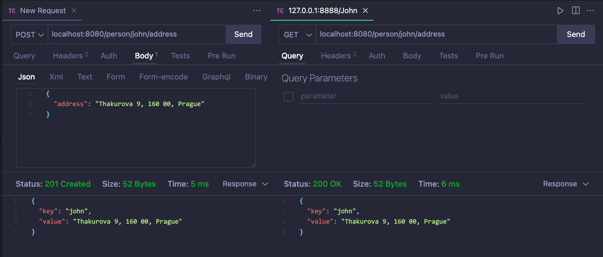

# Docker + Redis + Nodejs

## Run

-   commands
    ```bash
    $ cd src
    $ docker compose up
    ```
-   output
    ```bash
    [+] Running 3/0
    ⠿ Container redis-client  Created                                                                                                          0.0s
    ⠿ Container redis-server  Created                                                                                                          0.0s
    ⠿ Container node-server   Created                                                                                                          0.0s
    Attaching to node-server, redis-client, redis-server
    redis-server  | 1:C 09 Mar 2023 09:05:58.790 # oO0OoO0OoO0Oo Redis is starting oO0OoO0OoO0Oo
    redis-server  | 1:C 09 Mar 2023 09:05:58.790 # Redis version=7.0.9, bits=64, commit=00000000, modified=0, pid=1, just started
    redis-server  | 1:C 09 Mar 2023 09:05:58.790 # Warning: no config file specified, using the default config. In order to specify a config file use redis-server /path/to/redis.conf
    redis-server  | 1:M 09 Mar 2023 09:05:58.790 * monotonic clock: POSIX clock_gettime
    redis-server  | 1:M 09 Mar 2023 09:05:58.791 * Running mode=standalone, port=6379.
    redis-server  | 1:M 09 Mar 2023 09:05:58.791 # Server initialized
    redis-server  | 1:M 09 Mar 2023 09:05:58.792 * Loading RDB produced by version 7.0.9
    redis-server  | 1:M 09 Mar 2023 09:05:58.792 * RDB age 2 seconds
    redis-server  | 1:M 09 Mar 2023 09:05:58.792 * RDB memory usage when created 0.88 Mb
    redis-server  | 1:M 09 Mar 2023 09:05:58.792 * Done loading RDB, keys loaded: 1, keys expired: 0.
    redis-server  | 1:M 09 Mar 2023 09:05:58.792 * DB loaded from disk: 0.000 seconds
    redis-server  | 1:M 09 Mar 2023 09:05:58.792 * Ready to accept connections
    redis-client  | 1:C 09 Mar 2023 09:05:58.858 # oO0OoO0OoO0Oo Redis is starting oO0OoO0OoO0Oo
    redis-client  | 1:C 09 Mar 2023 09:05:58.858 # Redis version=7.0.9, bits=64, commit=00000000, modified=0, pid=1, just started
    redis-client  | 1:C 09 Mar 2023 09:05:58.858 # Warning: no config file specified, using the default config. In order to specify a config file use redis-server /path/to/redis.conf
    redis-client  | 1:M 09 Mar 2023 09:05:58.859 * monotonic clock: POSIX clock_gettime
    redis-client  | 1:M 09 Mar 2023 09:05:58.859 * Running mode=standalone, port=6379.
    redis-client  | 1:M 09 Mar 2023 09:05:58.859 # Server initialized
    redis-client  | 1:M 09 Mar 2023 09:05:58.860 * Loading RDB produced by version 7.0.9
    redis-client  | 1:M 09 Mar 2023 09:05:58.860 * RDB age 2 seconds
    redis-client  | 1:M 09 Mar 2023 09:05:58.860 * RDB memory usage when created 0.85 Mb
    redis-client  | 1:M 09 Mar 2023 09:05:58.860 * Done loading RDB, keys loaded: 0, keys expired: 0.
    redis-client  | 1:M 09 Mar 2023 09:05:58.860 * DB loaded from disk: 0.000 seconds
    redis-client  | 1:M 09 Mar 2023 09:05:58.860 * Ready to accept connections
    node-server   | Server running at http://localhost:8080/
    node-server   | Redis client connected
    ```

## Insert and Retrieve value



## Inserting value using CLI

### Redis client container

-   command
    ```bash
    $ docker exec -it redis-client sh
    ```
-   commands inside container
    ```
    # redis-cli -h redis-server
    redis-server:6379> ping
    PONG
    redis-server:6379> set jan "Prague Czech Republic"
    OK
    redis-server:6379> get jan
    "Prague Czech Republic"
    redis-server:6379>
    ```

### Retrieving data from host machine

-   command
    ```bash
    $ curl http://localhost:8080/person/jan/address
    ```
-   output
    ```bash
    {"key":"jan","value":"Prague Czech Republic"}%
    ```
