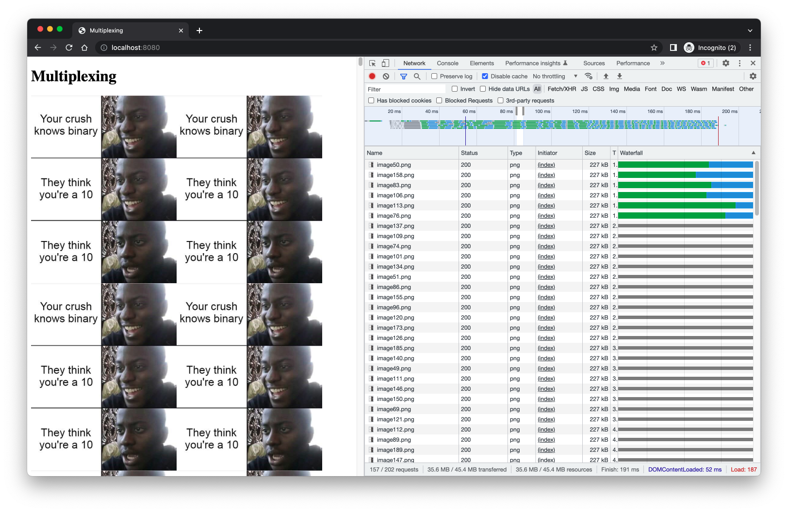
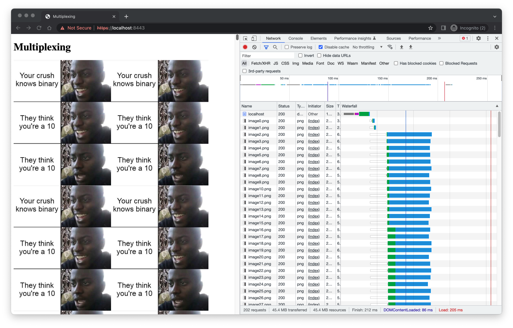

= 6. HTTP/2 multiplexing

Alternative task xref:push#[]

== Task

* This task is focused on limitations of browsers to achieve concurrency (e.g. only 6 HTTP requests in parallel for a single domain)
* Implement a simple HTTP/2 and HTTP/1.x server to demonstrate advantages of HTTP/2 communication and multiplexing
** Each server should serve a simple HTML page and requested resources (e.g. images)
** The HTML page should simultaneously and dynamically request large number of additional resources from the same server (e.g. hundreds of images)
** Demonstrate the differences between HTTP/2 and HTTP/1.x including multiple connections vs multiplexing, processing time etc.
* Use https://nodejs.org/api/http2.html[http2 module] for HTTP/2 server

== Instructions for submitting

* publish all your source code
* publish screenshots (or log from the execution) documenting the HTTP/2 vs HTTP/1.x solution

== Code Examples

*index.html* 

[source,javascript]
----
<!DOCTYPE html>
<html>
<head>
  <title>Title</title>
</head>
<body>
  Hello world! 
  
  ...
</body>
</html>
----

*HTTP/2 Server* 

[source,javascript]
----
const http2 = require('http2');
const fs = require('fs');

const server = http2.createSecureServer({
  key: fs.readFileSync('localhost-privkey.pem'),
  cert: fs.readFileSync('localhost-cert.pem')
});
server.on('error', (err) => console.error(err));

server.on('stream', (stream, headers) => {
  stream.respond({
    'content-type': 'text/html',
    ':status': 200
  });
  stream.end('<h1>Hello World</h1>');
});

server.listen(8443);
----

*certificate* 

[source,javascript]
----
openssl req -x509 -newkey rsa:2048 -nodes -sha256 -subj '/CN=localhost' \
  -keyout localhost-privkey.pem -out localhost-cert.pem
----

= 6. HTTP/2 push

Note: https://developer.chrome.com/blog/removing-push/[Support of HTTP/2 Server Push is disabled by default in Chrome 106 and other Chromium-based browsers in their next releases.]

== Task

* Implement an HTTP/2 push mechanism 
** Implement a simple HTML page consisting of at least 3 additional resources (e.g. css, js, image, ..)
** Implement a simple http server serving the page via HTTP/2
** When the html page is requested, push all those files together with the requested page
* Use https://nodejs.org/api/http2.html[http2 module]

== Instructions for submitting

* publish all your source code
* publish screenshots (or log from the execution) documenting the advantages of the http2 push

== Code Examples

*index.html* 

[source,javascript]
----
<!DOCTYPE html>
<html>
<head>
  <title>Title</title>
  <link rel="stylesheet" type="text/css" href="/static/style.css">
</head>
<body>
  Hello world! 
</body>
</html>
----

*HTTP/2 Server* 

[source,javascript]
----
const http2 = require('http2');
const fs = require('fs');

const server = http2.createSecureServer({
  key: fs.readFileSync('localhost-privkey.pem'),
  cert: fs.readFileSync('localhost-cert.pem')
});
server.on('error', (err) => console.error(err));

server.on('stream', (stream, headers) => {
  stream.respond({
    'content-type': 'text/html',
    ':status': 200
  });
  stream.end('<h1>Hello World</h1>');
});

server.listen(8443);
----

*certificate* 

[source,javascript]
----
openssl req -x509 -newkey rsa:2048 -nodes -sha256 -subj '/CN=localhost' \
  -keyout localhost-privkey.pem -out localhost-cert.pem
----

== Solution

=== Server push

Firstly, I implemented the alternative homework 6 - server push, but this feature isn't supported by the browser
anymore, so I couldn't test it.

=== Multiplexing

- Because of the failure with the Server push, I decided to also implement the second homework 6 - multiplexing. I created
  a webpage which loads 200 images and two servers (the first one uses the HTTP1 protocol, and the second one uses the HTTP2
  protocol).

- Following images show the loading process of both servers.

==== HTTP1

==== HTTP2

