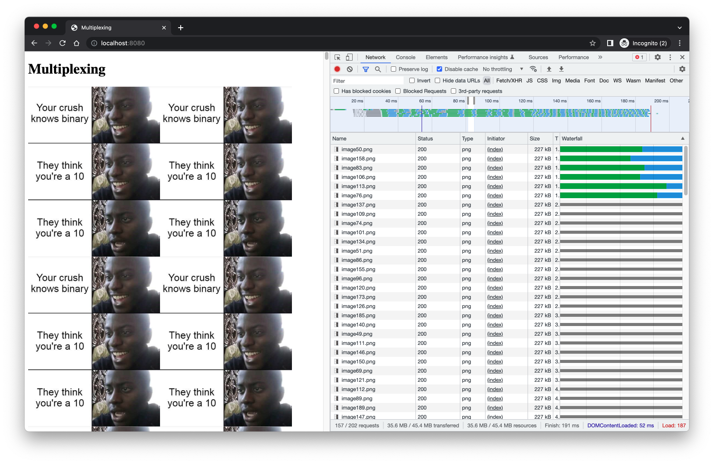
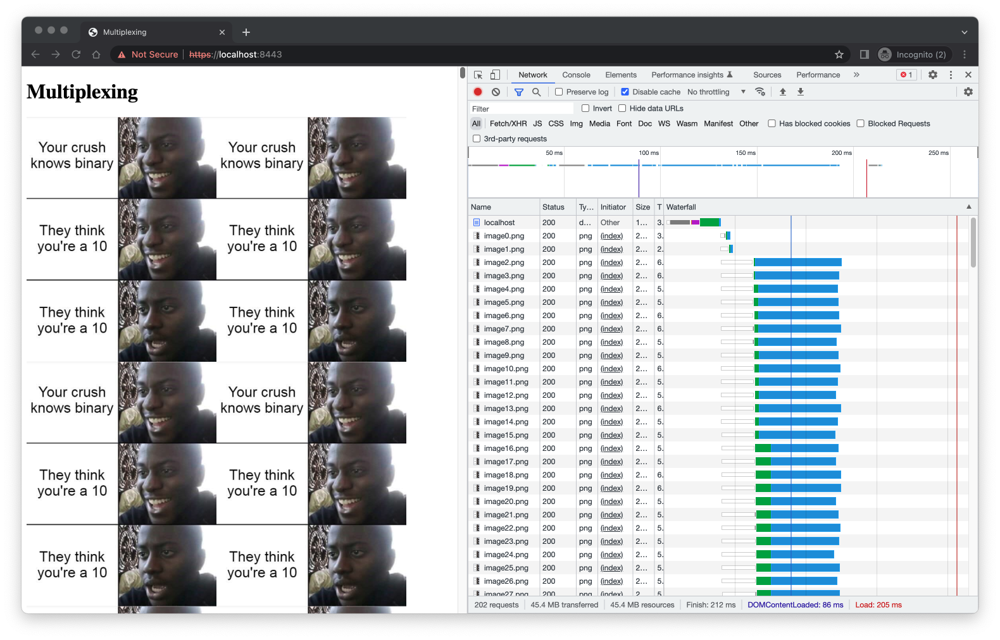

# HW 06

## Server push

Firstly, I implemented the alternative homework 6 - server push, but this feature isn't supported by the browser
anymore, so I couldn't test it.

## Multiplexing

- Because of the failure with the Server push, I decided to also implement the second homework 6 - multiplexing. I created
  a webpage which loads 200 images and two servers (the first one uses the HTTP1 protocol, and the second one uses the HTTP2
  protocol).

- Following images show the loading process of both servers.

### HTTP1

### HTTP2

