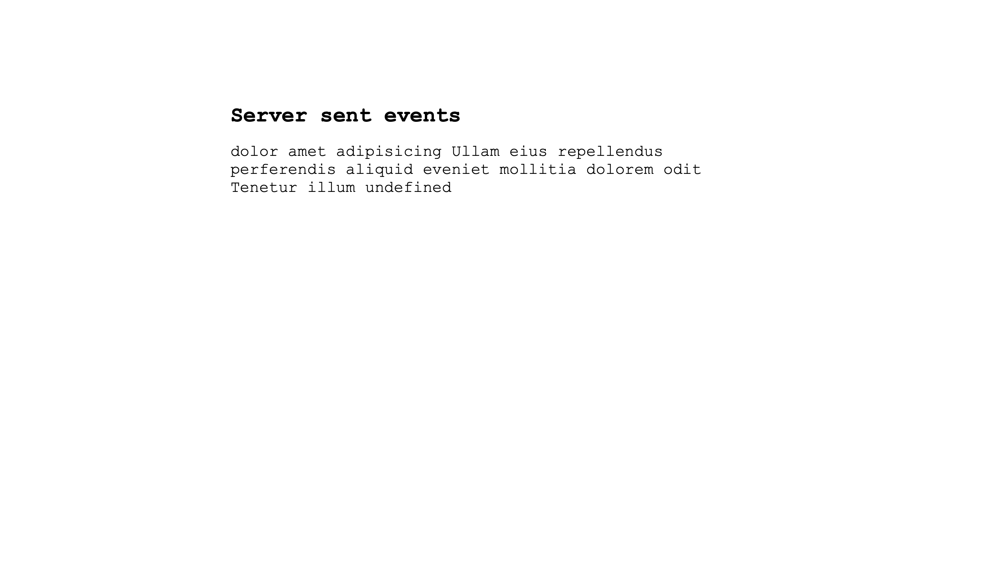

= 7. Server-Sent Events 

== Task

Design and implement simple SSE server in Node.js and simple client in HTML/JavaScript.

* The client connects to server and displays all incoming messages
* The server sends every 2 seconds one message - e.g. one line of text file.

Use http://nodejs.org and http://nodejs.org/api/http.html[http module].

== Instructions for submitting

* Provide description of the service design and realization
* Publish source code of your solution.

== Solution

=== Server

I have created a basic server that performs two tasks. The first task involves providing the HTML of the client.

[source,javascript]
----
fs.readFile("./index.html", function (err, data) {
	if (err) {
		res.statusCode = 500;
		res.end("Error getting index.html");
	} else {
		res.statusCode = 200;
		res.setHeader("Content-Type", "text/html");
		res.end(data);
	}
});
----

The second task is the server sent event. The server sends the familiar 'lorem ipsum' text word by word, with a 2-second interval. To accomplish this, I had to set the appropriate headers, add data to the response, and end the response with a double new line `\n\n`.

[source,javascript]
----
if (req.url === "/sse") {
	res.statusCode = 200;
	res.setHeader("Cache-Control", "no-cache");
	res.setHeader("connection", "keep-alive");
	res.setHeader("Content-Type", "text/event-stream");

	let interval = setInterval(() => {
		//If all data has been sent, stop
		if (nextChunkId >= data.length) {
			clearInterval(interval);
		}
		res.write(`id: ${nextChunkId}\ndata: ${data[nextChunkId]}\n\n`);
		nextChunkId++;
	}, 2000);
}
----

=== Client

The client is an HTML web application that connects to the server and adds received messages to the data displayed on the screen. Below is the code responsible for managing incoming messages.

[source,javascript]
----
message = document.getElementById("message");
receivedData = "";

const sseSource = new EventSource("/sse");

sseSource.onmessage = (event) => {
	receivedData += event.data + " ";
	message.textContent = receivedData;
};
----

==== Screenshot

==== Video

video::./results/video.mov[client screenrecording]
