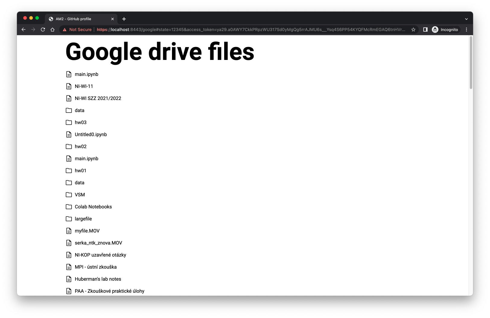

= 8. OAuth - Browser-Based App

== Task

Design and implement a simple OAuth - Browser-Based App. Browser-based apps run entirely in the browser after loading the source code from a web page.  

* Use a simple server (https) for serving static content (html, js, ...).
* Configure any OAuth application of your choice.
    * You can use any OAuth solution as authorization and resource server: http://docs.fit.cvut.cz/[Google], GitHub, ...
* The app in browser connects to the authorization server and allows access to the resources.
* The app collects an presents in the browser any resource from the resource server using the provided code/token (e.g. list of contacts, files, messages, repositories, ...)
* Do not use any OAuth library (e.g. GoogleAuth, ...)

Useful Links:

* https://docs.fit.cvut.cz
* https://console.developers.google.com/apis/library
* https://console.developers.google.com/apis/credentials
* https://myaccount.google.com/permissions

== Solution

First, I created an HTTP2 server that hosts all files, including:
  - **index.html** - page with authorization button

image::./results/app.png[app]
  
- **googleDriveFiles.html** - page displaying a content of users google drive

- **googleClient.js** - script responsible for fetching and displaying the google drive data

- **style.css** - just basic styling

I created the index page and registered the app in https://console.cloud.google.com/apis/dashboard[Google Developer Console]. Additionally, I added myself as a test user.

After that, I developer the client, where the user is redirected after authorizing the app using the following dialog.

image::./results/authorization.png[authorization dialog]

The client receives an access token through the URL, which can be used to retrieve information about files stored in a user's Google Drive. I made titles clickable and differentiated between files and folders using icons.