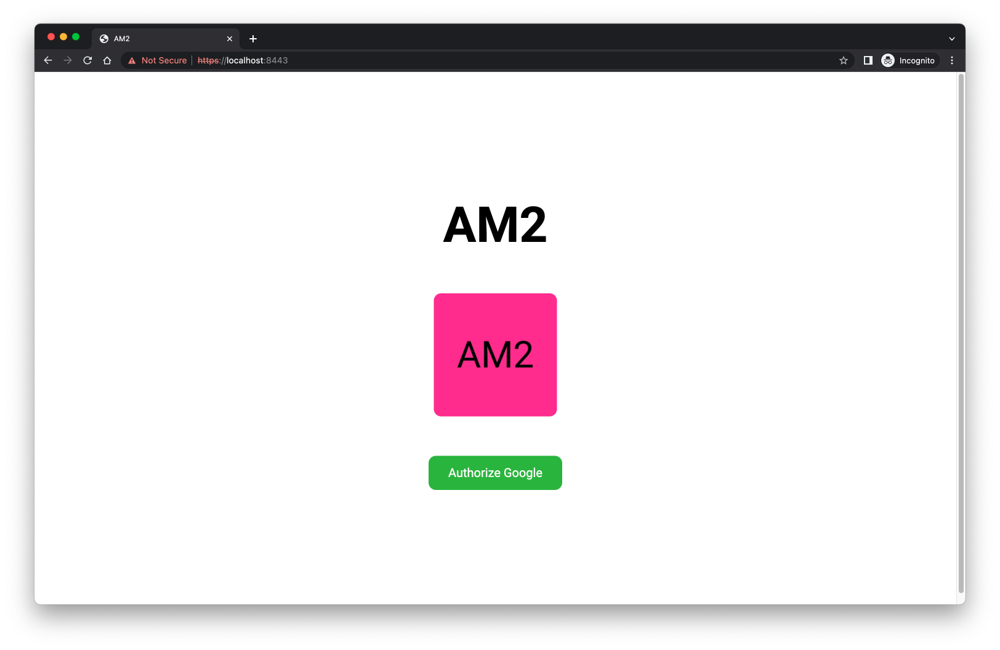
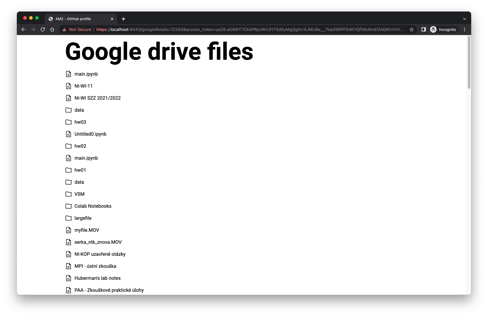
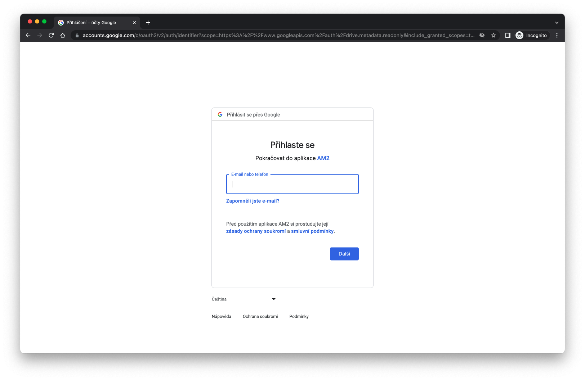

# HW 08 - OAuth2.0

First, I created an HTTP2 server that hosts all files, including:
  - **index.html** - page with authorization button
  
  - **googleDriveFiles.html** - page displaying a content of users google drive
  
  - **googleClient.js** - script responsible for fetching and displaying the google drive data
  - **style.css** - just basic styling

I created the index page and registered the app in [Google Developer Console](https://console.cloud.google.com/apis/dashboard). Additionally, I added myself as a test user.

After that, I developer the client, where the user is redirected after authorizing the app using the following dialog.

The client receives an access token through the URL, which can be used to retrieve information about files stored in a user's Google Drive. I made titles clickable and differentiated between files and folders using icons.